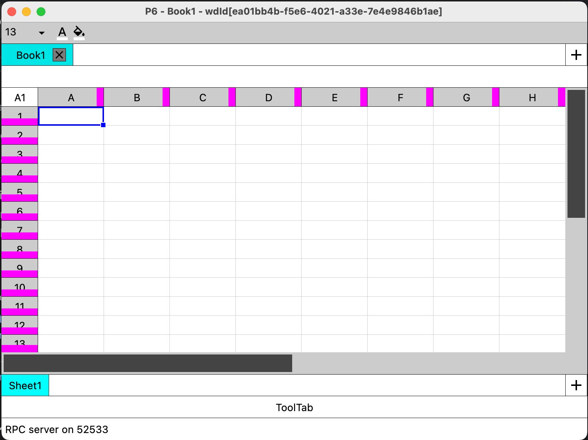

# P6 - a programmable spreadsheet app

The idea behind this app is to create a spreadsheet application that can be controlled programmatically by scripts or even by other programs.

The app is still in the early stages of development, so don't expect it to be feature-rich, stable, or remotely usable at this point

Here’s how it looks; don’t hold your breath, though.



## Prototype
A prototype can be downloaded from the release page of this repository.

Here's a direct link for a build on Mac: https://github.com/qxdzbc/p6/releases/download/prototype/p6-prototype-1.0.0.dmg

Builds for Windows and Linux will have to wait because I don't have machines with those operating systems.

However, a build can be run fairly easily on both Windows and Mac by following the instructions below.
## Build
- **Step 1: install Gradle if you don't have it yet.**
  - The project uses Gradle, so to build the app, you will need to install Gradle first. You can install Gradle from here: https://gradle.org
- **Step 2: run build commands**
  - After installing Gradle, open a terminal
  - Navigate to the project directory.
  - Build and publish dependencies to the local maven repo in your machine by running this:
    ```
      ./buildLib.sh
      ```
  - Build the app by running the below. Gradle output will tell you where to find your build.
    ```
     ./gradlew p6-app:package
    ```
